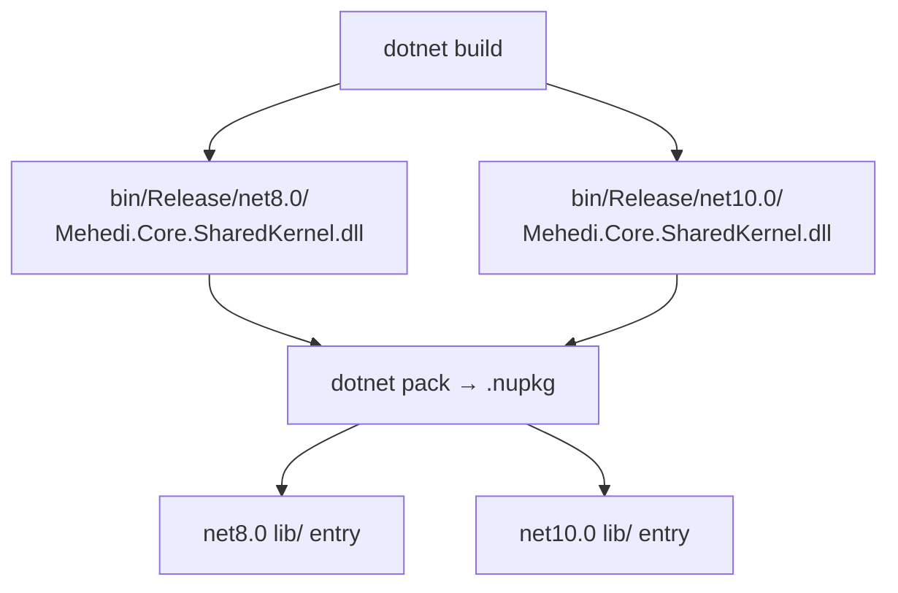

# ADR-002: Multi-Target net8.0 and net10.0

## Status
Accepted (as of v1.0.7)

## Context

The library originally targeted `net8.0` only. As .NET 10 was released and consumers began upgrading, requests came in to support .NET 10 without dropping .NET 8 (which is LTS until November 2026).

## Decision

Use `<TargetFrameworks>net8.0;net10.0</TargetFrameworks>` in `Directory.Build.props`. A single `dotnet pack` produces one `.nupkg` with both TFM artifacts:

```
lib/
  net8.0/
    Mehedi.Core.SharedKernel.dll
  net10.0/
    Mehedi.Core.SharedKernel.dll
```

## Alternatives Considered

- **Separate packages per TFM** — confusing for consumers; version drift risk.
- **netstandard2.1 only** — loses TFM-specific optimizations (e.g., `HashCode`, `ArgumentException.ThrowIfNullOrWhiteSpace` in newer APIs).
- **net10.0 only** — breaks .NET 8 LTS consumers.

## Consequences

- **Positive:** One package serves both audiences. No action required on consumers' part — NuGet resolves the best TFM.
- **Positive:** CI builds and tests both frameworks in the same pipeline run.
- **Negative:** Build time roughly doubles. For a small library this is negligible.
- **Future:** When .NET 8 reaches end-of-life (Nov 2026), drop the `net8.0` TFM in the next major version.

## How It Works



NuGet selects the highest compatible TFM at install time.

## Compatibility Matrix

| Consumer TFM | Resolved TFM |
|---|---|
| net8.0 | net8.0 |
| net9.0 | net8.0 (fallback) |
| net10.0 | net10.0 |
