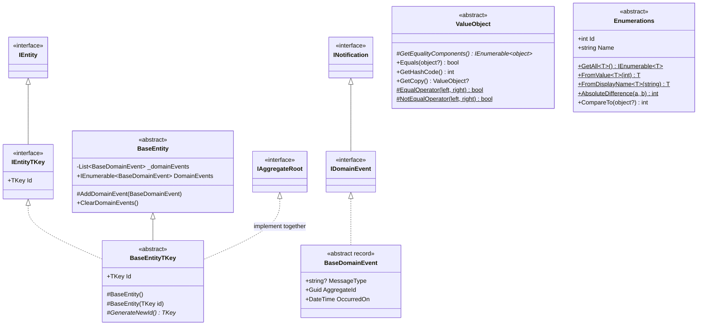
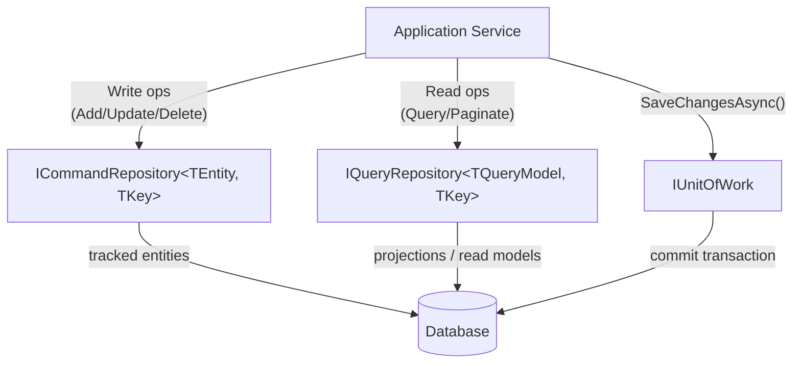
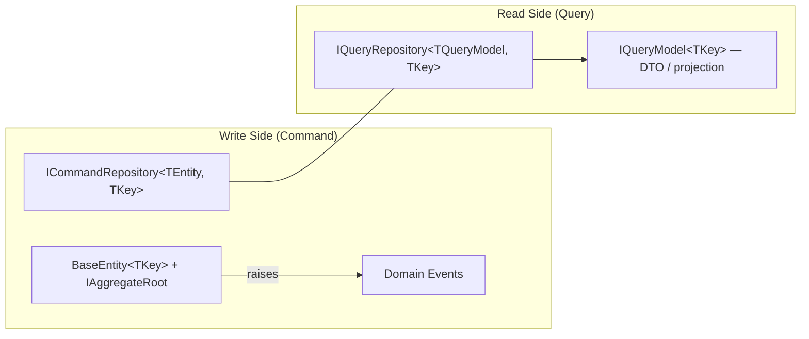
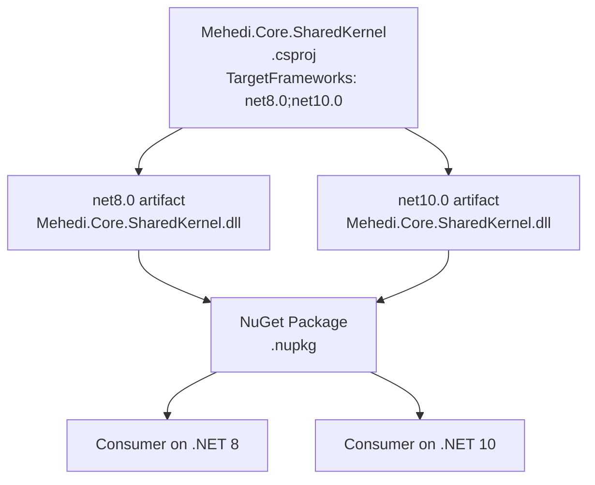

# Architecture

## Type Hierarchy



---

## Domain Event Flow

```mermaid
sequenceDiagram
    participant Client
    participant Aggregate as BaseEntity&lt;TKey&gt;
    participant EventList as _domainEvents
    participant MediatR
    participant Handler

    Client->>Aggregate: Call business method (e.g., Place())
    Aggregate->>EventList: AddDomainEvent(new OrderPlacedEvent(...))
    Aggregate-->>Client: return aggregate

    Note over Client: After SaveChanges / UoW commit
    Client->>Aggregate: DomainEvents (read)
    Aggregate-->>Client: IEnumerable&lt;BaseDomainEvent&gt;
    loop each event
        Client->>MediatR: Publish(event)
        MediatR->>Handler: Handle(event, ct)
        Handler-->>MediatR: Task.CompletedTask
    end
    Client->>Aggregate: ClearDomainEvents()
```

---

## Repository + Unit of Work Pattern



---

## CQRS Separation



The two sides use **different models**: write side uses full aggregate entities; read side uses lightweight `IQueryModel` DTOs optimized for display.

---

## Multi-Target Framework Strategy



Both TFM builds are packed into a single `.nupkg`. NuGet's `lib/` folder contains `lib/net8.0/` and `lib/net10.0/`. The runtime picks the best match automatically.

---

## Project Layout

```
mehedi.core.sharedkernel/
├── src/
│   └── Mehedi.Core.SharedKernel/     ← Published NuGet package
├── tests/
│   ├── UnitTests/                    ← Fast, isolated, no I/O
│   ├── IntegrationTests/             ← MediatR pipeline + repository contracts
│   ├── EndToEndTests/                ← Full DDD workflow scenarios
│   └── LoadTests/                    ← BenchmarkDotNet (run as Release exe)
├── samples/
│   └── OrderManagement/              ← Runnable console sample
└── docs/                             ← This documentation
```
