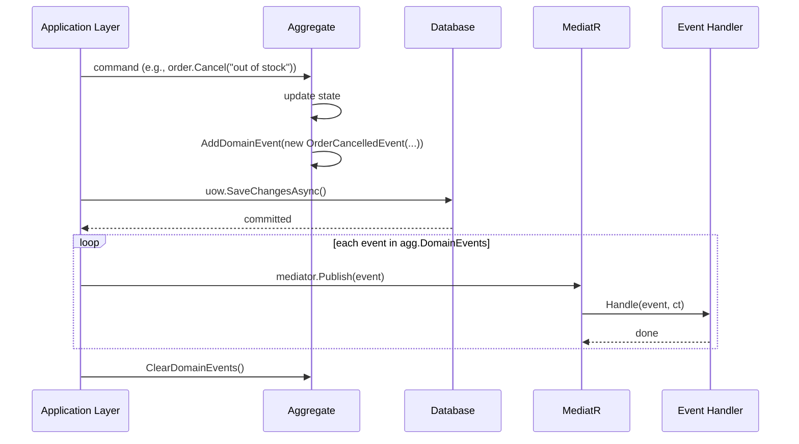

# Domain Events Pattern

## Overview

Domain events capture **what happened** inside a domain aggregate. They are raised in response to business operations and dispatched after the aggregate state is persisted.



## Defining Events

```csharp
// Positional record — concise, structural equality, immutable
public record OrderCancelledEvent(Guid OrderId, string Reason)
    : BaseDomainEvent(nameof(OrderCancelledEvent), OrderId);
```

**Convention:** pass `nameof(YourEventClass)` as `messageType`. This populates `MessageType` which is useful for event store storage and logging.

## Raising Events in Aggregates

Only aggregate roots should raise domain events:

```csharp
public sealed class Order : BaseEntity<Guid>, IAggregateRoot
{
    public void Cancel(string reason)
    {
        if (Status >= OrderStatus.Shipped)
            throw new InvalidOperationException("Cannot cancel shipped order.");

        Status = OrderStatus.Cancelled;
        AddDomainEvent(new OrderCancelledEvent(Id, reason));  // ← protected method
    }
}
```

## Dispatching Events

The recommended pattern is **dispatch-after-commit**:

```csharp
// After saving to DB
await uow.SaveChangesAsync(ct);

foreach (var evt in aggregate.DomainEvents)
    await mediator.Publish(evt, ct);

aggregate.ClearDomainEvents();
```

For multiple aggregates in one request, collect all events before dispatching:

```csharp
var allAggregates = new List<BaseEntity> { order, customer, inventory };
await uow.SaveChangesAsync(ct);

var allEvents = allAggregates.SelectMany(a => a.DomainEvents).ToList();
allAggregates.ForEach(a => a.ClearDomainEvents());

foreach (var evt in allEvents)
    await mediator.Publish(evt, ct);
```

## Handling Events

```csharp
public sealed class OrderCancelledHandler(IEmailService email)
    : INotificationHandler<OrderCancelledEvent>
{
    public async Task Handle(OrderCancelledEvent n, CancellationToken ct)
    {
        await email.SendCancellationNotificationAsync(n.OrderId, n.Reason, ct);
    }
}
```

Register handlers with MediatR's DI scanning:

```csharp
services.AddMediatR(cfg =>
    cfg.RegisterServicesFromAssembly(typeof(OrderCancelledHandler).Assembly));
```

## Event Properties

| Property | Source | Description |
|---|---|---|
| `MessageType` | Constructor arg `messageType` | Event class name — useful for routing/storage |
| `AggregateId` | Constructor arg `aggregateId` | Which aggregate raised this event |
| `OccurredOn` | Auto | UTC time of construction |
