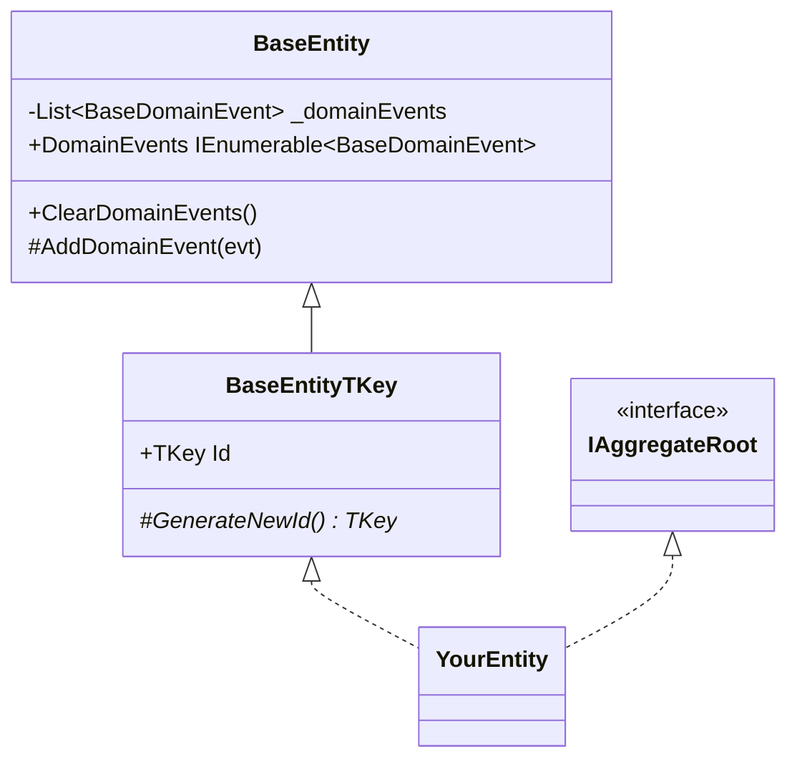
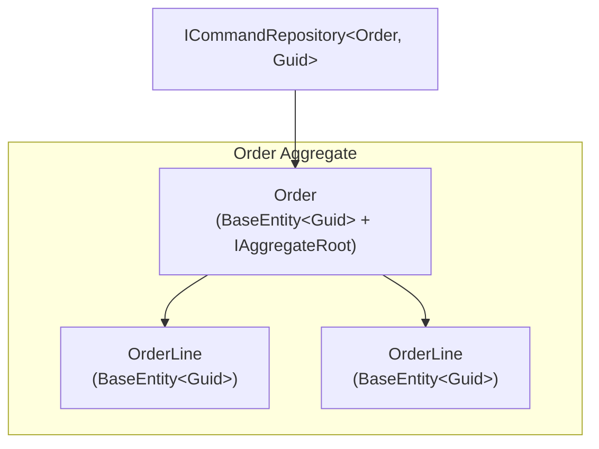

# Entity Pattern

## What Is an Entity?

An entity is an object defined by its **identity**, not its attributes. Two `Customer` objects with the same name but different IDs are different customers.



## Usage Rules

**Always inherit from `BaseEntity<TKey>`** for persistent entities that need an identity key:

```csharp
public sealed class Customer : BaseEntity<Guid>, IAggregateRoot
{
    public string Email { get; private set; }

    private Customer() : base() { Email = string.Empty; }

    public static Customer Register(string email)
    {
        var c = new Customer { Email = email };
        c.AddDomainEvent(new CustomerRegisteredEvent(c.Id, email));
        return c;
    }

    protected override Guid GenerateNewId() => Guid.NewGuid();
}
```

**Use `BaseEntity` (no key)** for EF Core keyless entities or child entities whose identity comes from the parent:

```csharp
public sealed class AuditLog : BaseEntity
{
    public string Action { get; }
    public DateTime PerformedAt { get; }

    public AuditLog(string action)
    {
        Action = action;
        PerformedAt = DateTime.UtcNow;
    }
}
```

## Key Type Guidance

| Key Type | When to use |
|---|---|
| `Guid` | Default — globally unique, no DB round-trip needed |
| `long` / `int` | Legacy schemas; sequential IDs assigned by DB |
| `string` | Natural keys (e.g., SKU codes, country ISO codes) |

## Aggregate Roots

Aggregate roots are the only entry point into an aggregate cluster. Mark them with `IAggregateRoot`:



External code interacts only with `Order`, never directly with `OrderLine`. The repository's generic type is the aggregate root.
