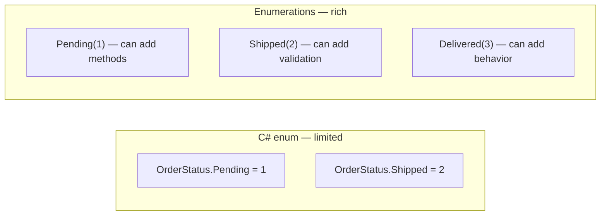

# Enumeration Pattern

## Why Not `enum`?

Standard C# enums cannot hold behavior, are easily cast from any `int`, and cannot be extended without breaking changes. The `Enumerations` class addresses all three:



## Defining an Enumeration

```csharp
public sealed class OrderStatus : Enumerations
{
    // IDs must never change — they are persisted
    public static readonly OrderStatus Pending   = new(1, "Pending");
    public static readonly OrderStatus Confirmed = new(2, "Confirmed");
    public static readonly OrderStatus Shipped   = new(3, "Shipped");
    public static readonly OrderStatus Delivered = new(4, "Delivered");
    public static readonly OrderStatus Cancelled = new(5, "Cancelled");

    // Private constructor — only static instances allowed
    private OrderStatus(int id, string name) : base(id, name) { }

    // Optional: add domain-specific behavior
    public bool IsTerminal => this == Delivered || this == Cancelled;
    public bool CanTransitionTo(OrderStatus target) => this < target || target == Cancelled;
}
```

## Lookup Methods

```csharp
// All instances
var all = Enumerations.GetAll<OrderStatus>();

// By Id
var status = Enumerations.FromValue<OrderStatus>(3);           // Shipped
// By Name (case-sensitive)
var status2 = Enumerations.FromDisplayName<OrderStatus>("Delivered");  // Delivered
// Invalid — throws InvalidOperationException
Enumerations.FromValue<OrderStatus>(99);
```

## Comparison and Sorting

```csharp
var pending = OrderStatus.Pending;
var shipped = OrderStatus.Shipped;

Console.WriteLine(pending < shipped);   // true
Console.WriteLine(shipped > pending);   // true
Console.WriteLine(pending == pending);  // true

var statuses = new[] { OrderStatus.Shipped, OrderStatus.Pending, OrderStatus.Confirmed };
var sorted = statuses.Order().ToList();  // Pending, Confirmed, Shipped
```

## Persistence with EF Core

Store `Id` in the database; reconstruct via `FromValue<T>`:

```csharp
// Entity configuration
builder.Property(o => o.Status)
    .HasConversion(
        v => v.Id,
        v => Enumerations.FromValue<OrderStatus>(v));
```

## Performance Warning

`GetAll<T>()` uses **uncached reflection**. For hot paths, cache the result:

```csharp
private static readonly IReadOnlyList<OrderStatus> _all =
    Enumerations.GetAll<OrderStatus>().ToList();
```
