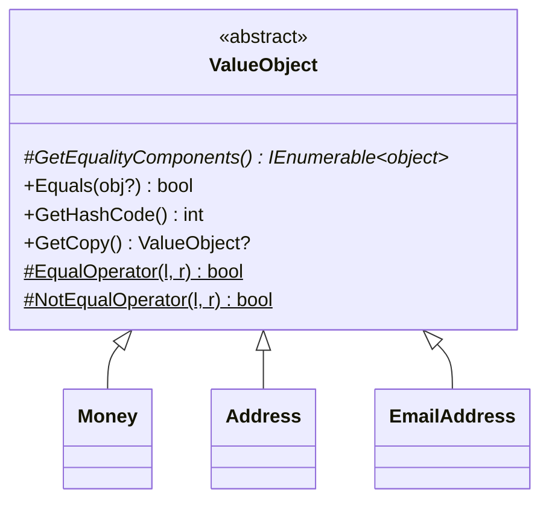

# Value Object Pattern

## What Is a Value Object?

A value object is defined by its **values**, not its identity. Two `Money(9.99, "USD")` instances are interchangeable — they represent the same concept.



## Implementation

```csharp
public sealed class Money : ValueObject
{
    public decimal Amount { get; }
    public string Currency { get; }

    public Money(decimal amount, string currency)
    {
        if (amount < 0) throw new ArgumentException("Negative amount.", nameof(amount));
        Amount = amount;
        Currency = currency.ToUpperInvariant();
    }

    // Expose operators — delegate to protected helpers
    public static bool operator ==(Money? left, Money? right) => EqualOperator(left, right);
    public static bool operator !=(Money? left, Money? right) => NotEqualOperator(left!, right!);

    // Behavior methods — value objects can have methods
    public Money Add(Money other)
    {
        if (other.Currency != Currency)
            throw new InvalidOperationException("Currency mismatch.");
        return new Money(Amount + other.Amount, Currency);
    }

    // Must implement
    protected override IEnumerable<object> GetEqualityComponents()
    {
        yield return Amount;
        yield return Currency;
    }
}
```

## Key Rules

1. **No setters** — value objects are immutable. Return new instances from mutation methods.
2. **All fields participate in equality** — yield every field from `GetEqualityComponents()`.
3. **No identity** — do not add an `Id` property.
4. **Use `GetCopy()`** when you need a snapshot (e.g., for event sourcing).

## Equality Behavior

```csharp
var a = new Money(9.99m, "USD");
var b = new Money(9.99m, "USD");
var c = new Money(9.99m, "EUR");

a.Equals(b);   // true  — same components
a == b;        // true  — if == operator implemented
a.Equals(c);   // false — Currency differs
a.Equals(null); // false — null-safe
```

## GetHashCode Warning

The current implementation uses XOR aggregation:

```csharp
// Current — has collision risk for symmetric/repeated values
GetEqualityComponents().Aggregate((x, y) => x ^ y)
```

For production use, override with `HashCode`:

```csharp
public override int GetHashCode()
{
    var hash = new HashCode();
    foreach (var c in GetEqualityComponents())
        hash.Add(c);
    return hash.ToHashCode();
}
```
